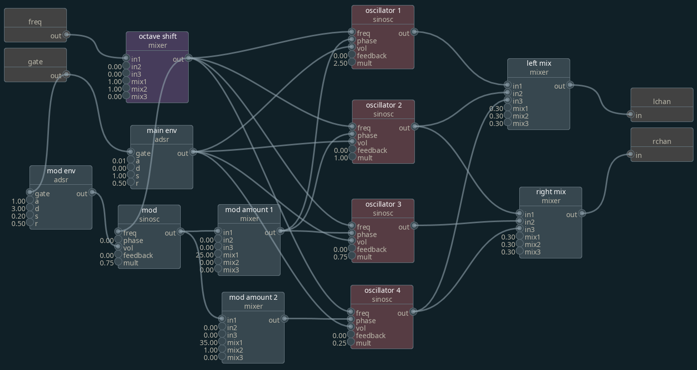

# Node based FM synthesizer

# Architecture
There are two subsytems that form the synthesizer. The _node editor_ is purely graphical, and is used to instantiate processing nodes and the connections between. The node editor connects through websocket to the _synth engine_. From the UI, the user can create a patch and then send it to the engine. This encodes the connection graph as JSON. Patches can be loaded/saved by the UI also using this format.

WHen the engine receives a patch, it immediately loads it. Any MIDI input to the engine will be sent as (frequency, gate) pairs to the patch. Left and right audio channels are routed to default sound device.

# Nodes
Each node can take one or more inputs. Connections from output to input of another node may be annotated with a _mult_ and _bias_ value. _Mult_ is a pre-multiplication for the incoming signal before it is applied to the destination node. _Bias_ is a constant offset applied to the signal.

## Sine Oscillator
- **freq** - FM or constant input
- **phase** - PM or constant input
- **feedback** - self-FM amount
- **mult** - output multiplier (volume)

## Mixer
Simple 3-way linear combination mixer. output = in1 * mix1 + in2 * mix2 + in23 * mix3

## ADSR
- **gate** - binary gate, non-zero is on
- **a, d, s, r** - attack, decay, systain, release of a typical ADSR

## Special nodes
- **freq** - input frequency from MIDI to patch
- **gate** - input keyboard gate from MIDI to patch
- **lchan** - output left channel from patch
- **rchan** - output right channel from patch

# Node editor keybinds
- s: create sinosc
- a: create adsr
- A: create mixer
- c: create or finish link
- d: delete node or links
- e: (node) edit name, (port) edit bias value
- E: (node) edit tint color, (port) edit mult value
- f: load patch from file
- F: save patch to file
- p: send current patch to websocket server
- P: reconnect with websocket server
- h: display help
